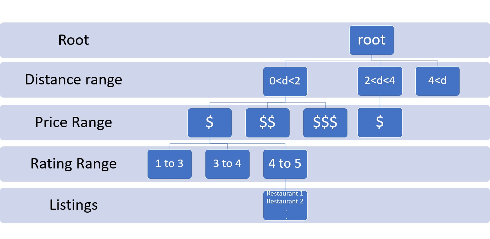

# SI507_final_project
Final project for SI507 course. Ann Arbor restaurant recommender

## To view demo of application 
  Please visit [Demo Video](https://drive.google.com/file/d/1GY0SCeXZ4KA43jxbLVLrcvwvAz_Vt792/view?usp=share_link)

## **To run the application -** 

- Dependencies - 
    python3 modules:
    ```
    flask
    tkinter
    requests
    ```

- Run command `python3 flask_app.py` file to run demo application using cached data
- Run command `python3 create_cache_data.py` to generate the cache data yourself
  Note: To run this file, you will have to enter your Google API in the  `sample_config.json`. 
  You can procure your API by visiting [Places API](https://developers.google.com/maps/documentation/places/web-service/overview) and setting up using instructions there.
  
## Tree structure details

The cached data of restaurant listings is loaded into a tree data structure when application is run. The tree structure is as shown below:



- To checkout how the data structure works, there is a sample cache data `sample_data_for_tree.json` which can be loaded into a tree and printed. 
- Run command `python3 create_tree.py` to check it out
